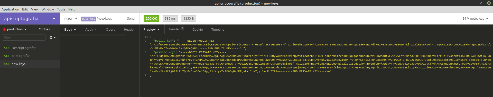
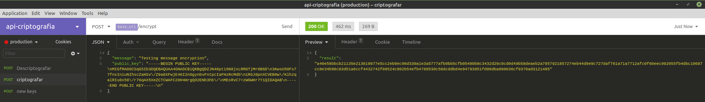
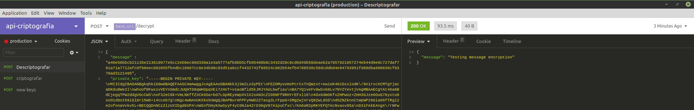

# API to encrypt and decrypt messages

API to encrypt and decrypt messages using public and private keys using the RSA algorithm.

## Installation

``composer install``

## Run server

``php artisan serve``

## Usage - examples

Generating keys

Encrypting a message

Decrypting a message

